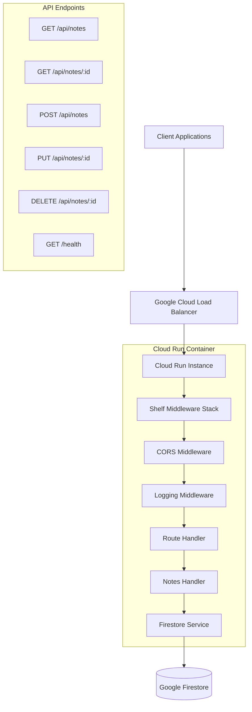

# Notes API Architecture

## Overview

This document outlines the architecture for a Dart-based REST API that provides CRUD operations for user notes, using Google Firestore as the database and deploying on Google Cloud Run.

## Technology Stack

- **Language**: Dart 3.7+
- **HTTP Framework**: Shelf (lightweight, composable)
- **Database**: Google Cloud Firestore
- **Deployment**: Google Cloud Run (containerized)
- **Authentication**: None initially (focus on core CRUD functionality)

## Data Model

### Note Entity
```dart
class Note {
  String id;           // Firestore document ID
  String title;        // Note title
  String content;      // Note body/content
  DateTime createdAt;  // Creation timestamp
  DateTime updatedAt;  // Last modification timestamp
}
```

### Firestore Collection Structure
```
notes/
├── {noteId1}/
│   ├── id: "auto-generated"
│   ├── title: "string"
│   ├── content: "string"
│   ├── createdAt: "timestamp"
│   └── updatedAt: "timestamp"
└── {noteId2}/
    └── ...
```

## API Endpoints

| Method | Endpoint | Description | Request Body | Response |
|--------|----------|-------------|--------------|----------|
| GET | `/api/notes` | List all notes | None | Array of notes |
| GET | `/api/notes/{id}` | Get specific note | None | Single note object |
| POST | `/api/notes` | Create new note | Note object (without id) | Created note with id |
| PUT | `/api/notes/{id}` | Update existing note | Note object | Updated note object |
| DELETE | `/api/notes/{id}` | Delete note | None | Success message |
| GET | `/health` | Health check | None | Status object |

### Request/Response Examples

#### Create Note (POST /api/notes)
```json
// Request
{
  "title": "My First Note",
  "content": "This is the content of my note"
}

// Response (201 Created)
{
  "id": "abc123",
  "title": "My First Note",
  "content": "This is the content of my note",
  "createdAt": "2025-05-30T13:30:00Z",
  "updatedAt": "2025-05-30T13:30:00Z"
}
```

#### Get All Notes (GET /api/notes)
```json
// Response (200 OK)
{
  "notes": [
    {
      "id": "abc123",
      "title": "My First Note",
      "content": "This is the content of my note",
      "createdAt": "2025-05-30T13:30:00Z",
      "updatedAt": "2025-05-30T13:30:00Z"
    }
  ],
  "count": 1
}
```

## Project Structure

```
notes_api/
├── bin/
│   └── server.dart              # Main server entry point
├── lib/
│   ├── models/
│   │   └── note.dart            # Note data model
│   ├── services/
│   │   └── firestore_service.dart # Firestore operations
│   ├── handlers/
│   │   └── notes_handler.dart   # HTTP request handlers
│   ├── middleware/
│   │   ├── cors_middleware.dart # CORS handling
│   │   └── logging_middleware.dart # Request logging
│   └── utils/
│       └── response_utils.dart  # HTTP response helpers
├── test/
│   ├── models/
│   ├── services/
│   └── handlers/
├── Dockerfile                   # Container configuration
├── .dockerignore
├── .env.example                 # Environment variables template
└── pubspec.yaml                # Dependencies
```

## Architecture Diagram



## Dependencies

### Production Dependencies
```yaml
dependencies:
  shelf: ^1.4.1                 # HTTP server framework
  shelf_router: ^1.1.4          # Routing middleware
  shelf_cors_headers: ^0.1.5    # CORS support
  cloud_firestore: ^4.15.8      # Firestore client
  googleapis_auth: ^1.4.1       # Google Cloud authentication
  dotenv: ^4.2.0               # Environment variables
  uuid: ^4.3.3                 # UUID generation
```

### Development Dependencies
```yaml
dev_dependencies:
  test: ^1.24.0                 # Testing framework
  lints: ^5.0.0                # Dart linting rules
  build_runner: ^2.4.9         # Code generation
```

## Implementation Components

### 1. Server Setup (bin/server.dart)
- Initialize Shelf server
- Configure middleware stack
- Set up routing
- Handle graceful shutdown

### 2. Data Model (lib/models/note.dart)
- Note class definition
- JSON serialization/deserialization
- Validation methods

### 3. Firestore Service (lib/services/firestore_service.dart)
- Database connection management
- CRUD operations
- Error handling
- Query optimization

### 4. Request Handlers (lib/handlers/notes_handler.dart)
- HTTP request processing
- Input validation
- Response formatting
- Error handling

### 5. Middleware Stack
- **CORS Middleware**: Handle cross-origin requests
- **Logging Middleware**: Request/response logging
- **Error Middleware**: Centralized error handling

## Error Handling Strategy

### HTTP Status Codes
- **200 OK**: Successful GET, PUT operations
- **201 Created**: Successful POST operations
- **204 No Content**: Successful DELETE operations
- **400 Bad Request**: Invalid input data
- **404 Not Found**: Resource not found
- **500 Internal Server Error**: Server/database errors

### Error Response Format
```json
{
  "error": {
    "code": "VALIDATION_ERROR",
    "message": "Title is required",
    "details": {
      "field": "title",
      "value": null
    }
  }
}
```

## Performance Considerations

### Database Optimization
- Efficient Firestore queries
- Proper indexing strategy
- Connection pooling
- Batch operations for bulk updates

### Server Optimization
- Request/response compression
- Efficient JSON parsing
- Memory management
- Connection keep-alive

### Cloud Run Configuration
- Auto-scaling settings
- Resource allocation
- Cold start optimization
- Health check configuration

## Security Considerations

### Current Implementation
- Input validation and sanitization
- HTTPS enforcement (Cloud Run default)
- Environment variable protection

### Future Enhancements
- Authentication middleware
- Rate limiting
- Request size limits
- SQL injection prevention (N/A for Firestore)

## Deployment Strategy

### Local Development
1. Use Firestore emulator for testing
2. Environment-based configuration
3. Hot reload for development

### Production Deployment
1. Docker containerization
2. Google Cloud Run deployment
3. Environment variable configuration
4. Health check endpoints

### CI/CD Pipeline (Future)
1. Automated testing
2. Code quality checks
3. Container building
4. Automated deployment

## Environment Configuration

### Required Environment Variables
```bash
# Google Cloud Configuration
GOOGLE_CLOUD_PROJECT_ID=your-project-id
FIRESTORE_DATABASE_ID=(default)

# Server Configuration
PORT=8080
ENVIRONMENT=production

# Logging
LOG_LEVEL=info
```

## Testing Strategy

### Unit Tests
- Model validation
- Service layer operations
- Utility functions

### Integration Tests
- API endpoint testing
- Database operations
- Middleware functionality

### End-to-End Tests
- Complete request/response cycles
- Error scenarios
- Performance testing

## Monitoring and Observability

### Logging
- Structured logging format
- Request/response logging
- Error tracking
- Performance metrics

### Health Checks
- Database connectivity
- Service availability
- Resource utilization

### Metrics (Future)
- Request latency
- Error rates
- Database performance
- Resource usage

## Scalability Considerations

### Horizontal Scaling
- Stateless application design
- Cloud Run auto-scaling
- Load balancing

### Database Scaling
- Firestore automatic scaling
- Query optimization
- Data partitioning strategies

## Future Enhancements

### Phase 2: Authentication
- Firebase Authentication integration
- JWT token validation
- User-specific notes

### Phase 3: Advanced Features
- Note categories and tags
- Search functionality
- Note sharing
- File attachments

### Phase 4: Performance
- Caching layer (Redis)
- Database optimization
- CDN integration
- Advanced monitoring

## Development Workflow

1. **Setup**: Initialize project dependencies and environment
2. **Core Implementation**: Build basic CRUD functionality
3. **Testing**: Implement comprehensive test suite
4. **Containerization**: Create Docker configuration
5. **Deployment**: Deploy to Google Cloud Run
6. **Monitoring**: Set up logging and health checks
7. **Documentation**: API documentation and guides

This architecture provides a solid foundation for a scalable, maintainable notes API that can grow with your application's needs.