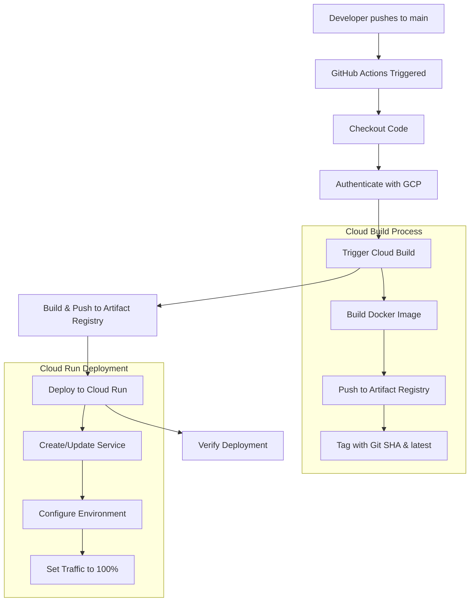

# GitHub Actions Cloud Run Deployment Plan

## Overview
This document outlines the implementation plan for automated deployment of the Dart Notes API to Google Cloud Run using GitHub Actions. The deployment will be triggered automatically when code is merged to the main branch.

## Current Architecture Analysis

### Project Structure
- **Language**: Dart with AOT compilation
- **Database**: Google Firestore (managed via Terraform)
- **Container Registry**: Google Artifact Registry
- **Build System**: Google Cloud Build with existing [`cloudbuild.yaml`](cloudbuild.yaml)
- **Infrastructure**: Terraform-managed GCP resources
- **Target Platform**: Google Cloud Run

### Existing Components
- ✅ [`Dockerfile`](Dockerfile) - Multi-stage build with AOT compilation
- ✅ [`cloudbuild.yaml`](cloudbuild.yaml) - Cloud Build configuration
- ✅ [`terraform/main.tf`](terraform/main.tf) - Infrastructure as Code
- ✅ Service Account with Firestore permissions
- ✅ Artifact Registry repository

## Deployment Architecture



## Implementation Plan

### 1. GitHub Actions Workflow Configuration

**File Location**: `.github/workflows/deploy-to-cloudrun.yml`

**Trigger Configuration**:
```yaml
on:
  push:
    branches: [ main ]
  pull_request:
    branches: [ main ]
    types: [ closed ]
```

**Runner**: `ubuntu-latest` for cost efficiency and reliability

### 2. Required GitHub Secrets

The following secrets must be configured in the GitHub repository:

| Secret Name | Description | Example Value |
|-------------|-------------|---------------|
| `GCP_PROJECT_ID` | Google Cloud Project ID | `notes-api-abc123` |
| `GCP_SA_KEY` | Base64 encoded service account JSON key | `ewogICJ0eXBlIjogInNlcnZpY2VfYWNjb3VudCIsC...` |
| `GCP_REGION` | Deployment region | `us-central1` |
| `CLOUD_RUN_SERVICE_NAME` | Cloud Run service name | `notes-api` |

### 3. Service Account Permissions

The service account used for deployment requires these IAM roles:

- **Cloud Build Editor** (`roles/cloudbuild.builds.editor`)
  - Trigger and manage Cloud Build jobs
- **Cloud Run Admin** (`roles/run.admin`)
  - Deploy and manage Cloud Run services
- **Artifact Registry Reader** (`roles/artifactregistry.reader`)
  - Pull container images from registry
- **Service Account User** (`roles/iam.serviceAccountUser`)
  - Run services as the designated service account

### 4. Workflow Steps Detail

#### Step 1: Environment Setup
- Checkout repository code with full Git history
- Set up Google Cloud SDK
- Authenticate using service account key
- Configure gcloud with project settings

#### Step 2: Build Process
- Trigger Cloud Build using existing [`cloudbuild.yaml`](cloudbuild.yaml)
- Pass dynamic substitutions:
  - `_TAG`: Git SHA for unique image tagging
  - `_REGION`: Target deployment region
  - `_REPOSITORY`: Artifact Registry repository name
- Monitor build progress and handle failures

#### Step 3: Deployment Process
- Deploy to Cloud Run using newly built image
- Service configuration:
  - **Memory**: 512Mi (adjustable based on load testing)
  - **CPU**: 1 vCPU (auto-scaling enabled)
  - **Concurrency**: 80 requests per instance
  - **Min Instances**: 0 (cost optimization)
  - **Max Instances**: 10 (prevent runaway scaling)
- Environment variables:
  - `GOOGLE_CLOUD_PROJECT_ID`: From Terraform output
  - `PORT`: 8080 (matching Dockerfile)
  - `ENVIRONMENT`: production

#### Step 4: Post-Deployment Verification
- Health check on deployed service
- Output deployment URL and revision information
- Log deployment success/failure

### 5. Enhanced Cloud Build Integration

**Current [`cloudbuild.yaml`](cloudbuild.yaml) Enhancements**:
- Dynamic tagging with Git SHA
- Conditional Cloud Run deployment step
- Improved substitution variable handling
- Build optimization for faster deployments

### 6. Security Considerations

#### Authentication
- Service account key stored as encrypted GitHub secret
- Principle of least privilege for IAM roles
- No hardcoded credentials in workflow files

#### Build Security
- Container image scanning (optional enhancement)
- Dependency vulnerability checks
- Secure handling of environment variables

### 7. Monitoring and Observability

#### GitHub Actions
- Build and deployment status in GitHub UI
- Detailed logs for troubleshooting
- Integration with GitHub notifications

#### Google Cloud
- Cloud Build history and logs
- Cloud Run service metrics and logs
- Error reporting and alerting

### 8. Rollback Strategy

#### Automated Rollback Triggers
- Health check failures
- High error rates post-deployment
- Manual trigger via GitHub Actions

#### Rollback Process
1. Identify previous stable revision
2. Route traffic back to stable version
3. Investigate and fix issues
4. Redeploy when ready

### 9. Environment Configuration

#### Production Settings
- **Service Account**: Use existing `notes-api-service` from Terraform
- **Database**: Connect to Firestore instance created by Terraform
- **Networking**: Allow unauthenticated access (API endpoints)
- **Scaling**: Auto-scale based on request volume

#### Environment Variables
```bash
GOOGLE_CLOUD_PROJECT_ID=${PROJECT_ID}
PORT=8080
ENVIRONMENT=production
```

### 10. Cost Optimization

#### Cloud Run
- Pay-per-request pricing model
- Automatic scaling to zero when idle
- Efficient resource allocation

#### Cloud Build
- Use of existing build configuration
- Optimized build steps for faster execution
- Appropriate machine type selection

## Implementation Checklist

### Prerequisites
- [ ] GitHub repository with admin access
- [ ] Google Cloud Project with billing enabled
- [ ] Terraform infrastructure deployed
- [ ] Service account with appropriate permissions

### Setup Steps
1. [ ] Create service account key and download JSON
2. [ ] Configure GitHub repository secrets
3. [ ] Create GitHub Actions workflow file
4. [ ] Update Cloud Build configuration (if needed)
5. [ ] Test deployment with a sample commit
6. [ ] Verify Cloud Run service functionality
7. [ ] Set up monitoring and alerting

### Testing Strategy
1. **Unit Tests**: Run existing Dart tests in workflow
2. **Integration Tests**: Test API endpoints post-deployment
3. **Smoke Tests**: Verify critical functionality
4. **Load Tests**: Ensure performance under load (optional)

## Future Enhancements

### Short Term
- Add automated testing before deployment
- Implement deployment notifications (Slack/email)
- Add database migration steps if needed

### Long Term
- Implement blue-green deployment strategy
- Add staging environment deployment
- Integrate with monitoring and alerting systems
- Implement canary deployments for safer releases

## Troubleshooting Guide

### Common Issues
1. **Authentication Failures**: Verify service account key and permissions
2. **Build Failures**: Check Cloud Build logs and Dockerfile
3. **Deployment Failures**: Verify Cloud Run service configuration
4. **Runtime Errors**: Check application logs and environment variables

### Debug Commands
```bash
# Check Cloud Run service status
gcloud run services describe notes-api --region=us-central1

# View recent deployments
gcloud run revisions list --service=notes-api --region=us-central1

# Check build history
gcloud builds list --limit=10

# View service logs
gcloud logs read --service=notes-api --limit=50
```

## Conclusion

This deployment plan provides a robust, automated CI/CD pipeline for the Dart Notes API using GitHub Actions and Google Cloud services. The implementation leverages existing infrastructure and build configurations while adding automated deployment capabilities for improved development velocity and reliability.

The plan prioritizes security, cost optimization, and maintainability while providing clear rollback strategies and monitoring capabilities.